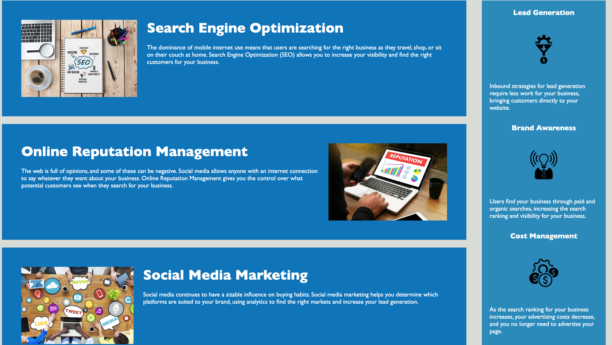

# Homework--1

# 01 HTML, CSS, and Git: Code Refactor

Description
This repository contains the refactored code for Horiseon Social Solution Services website so that there are now accessible features for people with disabilities. People with disabilities can now access Horiseon's website using assistive technologies such as video captions, screen readers, and braille keyboards. In search engines, such as Google, the website will now be better positioned and optimized due to this added feature.

Previously, there were also some imperfections within the code, so I have changed and improved the codebase and functionality of the website. The links within the navigation bar were not functioning, but now they will take the user to the designated spot within the website. When viewing the source code, you will now find that semantic HTML elements are being used and are positioned in a logical order. A title to the page has also been added so that it reads "Horiseon Social Solution Services". Overall, this code is now more efficient and the website will be more sustainable in the long-term.

Website URL: https://github.com/dobsonkevyn/Homework--1.git

Screenshot
The following image shows the web application's initial appearance:

